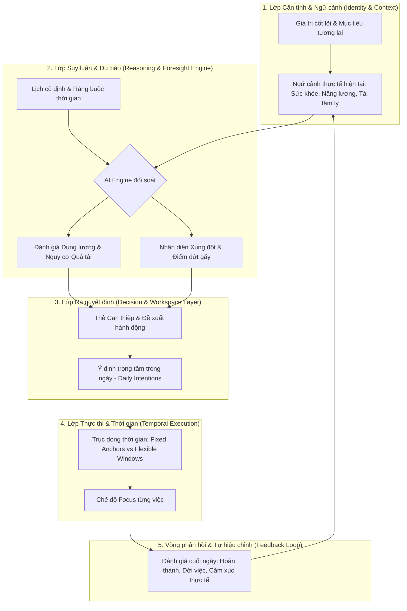
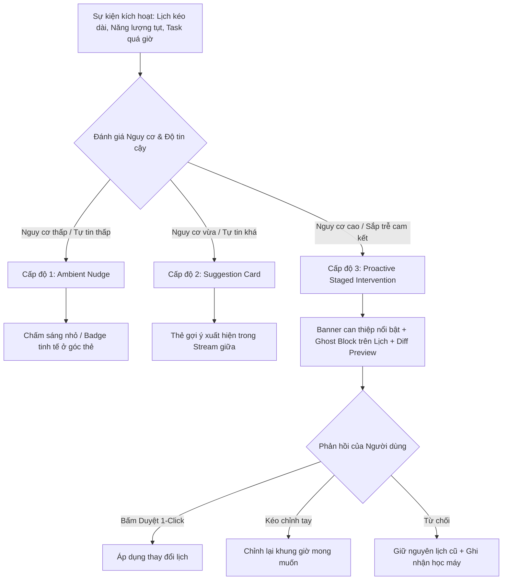

# Nghiên Cứu và Phân Tích Thiết Kế Giao Diện Tham Khảo Cho Future Me

> **Tài liệu**: Phân tích đối sánh UX/UI (Reference Analysis)  
> **Sản phẩm mục tiêu**: Future Me (Web App hỗ trợ ra quyết định cá nhân dựa trên ngữ cảnh, thời gian và suy luận AI)  
> **Tài liệu tham khảo đối sánh**: [mymind](https://mymind.com), [Sunsama](https://www.sunsama.com), [Reclaim.ai](https://reclaim.ai)  
> **Phương pháp**: ui-ux-pro-max intelligence + Phân loại bằng chứng thực nghiệm (`Observed` / `Inferred` / `Unknown`)  
> **Trạng thái**: Bản nghiên cứu tiền thiết kế (Pre-design system specification)

---

## Mục lục

1. [Các bài toán UX Future Me cần giải quyết](#1-các-bài-toán-ux-future-me-cần-giải-quyết)
2. [Phân tích mymind — Ngôn ngữ thị giác & Sự yên tĩnh (Visual Language & Calmness)](#2-phân-tích-mymind--ngôn-ngữ-thị-giác--sự-yên-tĩnh)
3. [Phân tích Sunsama — Khung ứng dụng & Không gian làm việc (Workspace Shell & Rituals)](#3-phân-tích-sunsama--khung-ứng-dụng--không-gian-làm-việc)
4. [Phân tích Reclaim.ai — Lập lịch AI, Đột biến Lịch & Quyền kiểm soát (AI Scheduling & Control)](#4-phân-tích-reclaimai--lập-lịch-ai-đột-biến-lịch--quyền-kiểm-soát)
5. [Ma trận so sánh chéo giữa 3 sản phẩm](#5-ma-trận-so-sánh-chéo-giữa-3-sản-phẩm)
6. [Các Pattern đề xuất Áp dụng (Adopt)](#6-các-pattern-đề-xuất-áp-dụng-adopt)
7. [Các Pattern đề xuất Thích nghi (Adapt)](#7-các-pattern-đề-xuất-thích-nghi-adapt)
8. [Các Pattern đề xuất Loại bỏ (Discard / Anti-patterns)](#8-các-pattern-đề-xuất-loại-bỏ-discard--anti-patterns)
9. [Đề xuất Khung ứng dụng (Proposed Application Shell)](#9-đề-xuất-khung-ứng-dụng-proposed-application-shell)
10. [Đề xuất Kiến trúc thông tin (Proposed Information Architecture)](#10-đề-xuất-kiến-trúc-thông-tin-proposed-information-architecture)
11. [Đề xuất Định hướng thị giác (Proposed Visual Direction)](#11-đề-xuất-định-hướng-thị-giác-proposed-visual-direction)
12. [Đề xuất Mô hình biểu diễn Lịch & Dòng thời gian (Proposed Calendar & Temporal Representation)](#12-đề-xuất-mô-hình-biểu-diễn-lịch--dòng-thời-gian)
13. [Đề xuất Tương tác Khuyến nghị & Can thiệp của AI (Proposed AI Recommendation & Intervention Interaction)](#13-đề-xuất-tương-tác-khuyến-nghị--can-thiệp-của-ai)
14. [Cơ chế Tin cậy, Giải thích & Xác nhận (Trust, Explainability & Confirmation)](#14-cơ-chế-tin-cậy-giải-thích--xác-nhận)
15. [Cân nhắc Thiết kế Đa thiết bị (Responsive Considerations)](#15-cân-nhắc-thiết-kế-đa-thiết-bị-responsive-considerations)
16. [Cân nhắc Tiếp cận & Trợ năng (Accessibility Considerations)](#16-cân-nhắc-tiếp-cận--trợ-năng-accessibility-considerations)
17. [Điểm chưa kiểm chứng & Câu hỏi mở (Unknowns & Open Questions)](#17-điểm-chưa-kiểm-chứng--câu-hỏi-mở)

---

## 1. Các bài toán UX Future Me cần giải quyết

Future Me **không phải** là một công cụ quản lý công việc (task tracker), không phải là ứng dụng xem lịch thuần túy (calendar viewer), không phải là dashboard số liệu thống kê khô cứng, và càng không phải là một chatbot AI có khung chat dán cạnh một cuốn lịch.

Bản chất của Future Me là một **Môi trường Hỗ trợ Ra Quyết định Cá nhân (Personal Decision-Support Workspace)** trong sự vận động liên tục giữa **Mục tiêu tương lai**, **Ngữ cảnh hiện tại**, và **Ràng buộc thời gian thực tế**.

Cụ thể, giao diện Future Me phải giải quyết 7 bài toán UX gốc:

1. **Ngữ cảnh cá nhân biến thiên (Dynamic Personal Context):**
   Người dùng không phải là một cỗ máy cố định. Mức năng lượng, tâm trạng, tình trạng sức khỏe, áp lực đột xuất và bối cảnh sống thay đổi theo từng giờ, từng ngày. Giao diện phải tiếp nhận và phản ánh ngữ cảnh này mà không bắt người dùng điền form khảo sát dài dòng.
2. **Nhận thức thời gian và giới hạn dung lượng thực tế (Temporal & Capacity Awareness):**
   Người dùng thường mắc "ảo tưởng kế hoạch" (Planning Fallacy) – nhồi nhét 12 tiếng công việc vào một ngày chỉ có 4 tiếng trống thực sự giữa các cuộc họp. UI phải làm rõ dung lượng khả dụng (available capacity) và áp lực dồn nén (cognitive load / overcommitment) mà không gây hoảng loạn.
3. **Minh bạch hóa suy luận AI (Explainable AI Reasoning):**
   AI không được là một "hộp đen" tự động ra lệnh hay tự dịch chuyển lịch mà không nêu lý do. Người dùng cần hiểu: *Tại sao AI lại gợi ý hoãn việc này? Dựa trên mối liên hệ nào giữa năng lượng hiện tại và deadline ngày mai?*
4. **Cân bằng giữa Chủ động Can thiệp và Tôn trọng Ý chí (Intervention vs. User Autonomy):**
   Hệ thống cần can thiệp khi người dùng sắp trật bánh (burnout, trễ cam kết dài hạn), nhưng nếu can thiệp quá thô bạo (pop-up, push notification dồn dập, tự sửa lịch) sẽ gây khó chịu và mất lòng tin. UI phải thiết kế các cấp độ can thiệp (ambient nudge -> suggestion card -> proactive intervention).
5. **Biểu diễn sự không chắc chắn (Visualizing Uncertainty):**
   Dự báo tương lai và suy luận tâm lý luôn có độ bất định (confidence score). Giao diện không được thể hiện suy đoán AI bằng những đường nét cứng nhắc tuyệt đối như sự kiện lịch Google, mà phải có ngôn ngữ thị giác riêng cho giả thuyết (hypothesis / provisional block).
6. **Tái lập kế hoạch khi thực tế đổi thay (Frictionless Replanning):**
   Khi một cuộc họp đột xuất kéo dài 2 tiếng, toàn bộ lịch chiều bị vỡ. Trải nghiệm sắp xếp lại (reschedule) không được bắt người dùng kéo thả từng block thủ công, nhưng cũng không được tự động đảo lộn calendar mà không qua bước "duyệt nhanh" (staging & preview).
7. **Vòng lặp xác nhận và hiệu chỉnh (Feedback & Calibration Loop):**
   Người dùng chấp nhận, từ chối hoặc chỉnh sửa gợi ý của AI. Giao diện phải ghi nhận hành động này một cách mượt mà để thuật ngữ suy luận ngày càng tiệm cận thói quen thực tế của từng cá nhân.

---

## 2. Phân tích mymind — Ngôn ngữ thị giác & Sự yên tĩnh

*Tham khảo chính: Visual Language, Calmness, Whitespace, Restrained Color, Content-First, Progressive Disclosure.*

### 2.1. Phân loại bằng chứng (Evidence Classification)
* **Observed (Quan sát trực tiếp):**
  * **Layout:** Dạng lưới thẻ tự do (masonry card grid), khoảng đệm (gap) rộng rãi, các khối không bị ép buộc theo bảng biểu cứng.
  * **Typography:** Kết hợp đối lập chủ đích giữa serif giàu tính văn học/biên tập (`Louize-Regular-205TF` / editorial serif) làm tiêu đề lớn và monospace (`Space Mono`) cho các thẻ ghi chú, metadata; phụ trợ bằng sans-serif trung tính cho nút bấm và nhãn.
  * **Color:** Nền ấm ngả be/ngà (`#FBFBFA` hoặc off-white), chữ chính màu slate xám đậm (`#383F4A`, `#3A475A`) thay vì đen tuyền `#000000`. Màu nhấn (accents) xuất hiện dưới dạng các tag "bubble" màu pastel tiết chế (cam đất, hồng phấn, xanh da trời nhạt, vàng mỡ gà).
  * **Progressive Disclosure:** Mặt thẻ (card surface) không chứa các nút quản trị lộn xộn (không nút chia sẻ, không like, không comment, không thống kê view). Công cụ tag, lưu trữ, xóa chỉ xuất hiện khi hover chuột hoặc chọn thẻ.
  * **Visual Tone:** Không có cảm giác "công cụ quản trị doanh nghiệp" (no dashboard anxiety). Không có thanh tiến độ đỏ, không có chuông thông báo đỏ chót.
* **Inferred (Suy luận hợp lý):**
  * mymind cố tình loại bỏ triệt để cấu trúc thư mục (folders) và phân loại thủ công để xóa bỏ "tội lỗi của sự lộn xộn" (guilt of disorganization), trao toàn bộ việc trích xuất thực thể, màu sắc, tag ngữ nghĩa cho AI ngầm.
  * Cảm giác thư thái (calmness) đến từ việc giảm mật độ dữ liệu trên một viewport (low density), ưu tiên độ sâu cảm xúc của từng mẩu nội dung.
* **Unknown (Chưa kiểm chứng):**
  * Mức độ chịu tải của ngôn ngữ thị giác này khi áp dụng vào luồng công việc phức tạp đòi hỏi xem đồng thời lịch 24 giờ và danh sách cam kết dày đặc.

### 2.2. Phân tích Pattern chi tiết

#### Pattern M1: Thẻ nội dung đa hình thái (Polymorphic Content Cards)
1. **Reference đang làm gì:** mymind biến đổi diện mạo của thẻ tùy theo kiểu dữ liệu: trích dẫn (quote) hiện bằng font serif khổ lớn trên nền trắng; mã màu hiện thành một mảng swatch màu lớn; liên kết hiện thành preview gọn gàng; ghi chú hiện như trang sổ tay.
2. **Giải quyết vấn đề gì:** Tránh sự đơn điệu, giúp não bộ nhận biết kiểu thông tin bằng mắt (visual scanning) cực nhanh mà không cần đọc nhãn văn bản.
3. **Có phù hợp với Future Me không:** **Rất phù hợp.** Future Me xử lý nhiều loại thực thể: *Mục tiêu dài hạn, Trạng thái năng lượng hiện tại, Đề xuất can thiệp của AI, Cam kết cố định, Lời khuyên tự phản tỉnh*.
4. **Future Me nên adapt thế nào:** Biến thẻ của mymind thành **Decision & Context Cards**:
   * *Card Ngữ cảnh:* Nền dịu nhẹ, icon trạng thái, text cô đọng.
   * *Card Đề xuất AI:* Nền có viền mờ tinh tế, nêu rõ đề xuất hành động và tác động đến tương lai.
   * *Card Cam kết:* Thể hiện thời lượng và khung giờ.
5. **Những gì không nên copy:** Không dùng bố cục masonry trôi nổi vô tận của mymind cho toàn bộ không gian làm việc chính. Lịch trình và quyết định cần cấu trúc trục thời gian rõ ràng, không thể thả nổi trôi dạt.

#### Pattern M2: Bảng màu tiết chế & Nền ấm không phản quang (Warm Off-white & Slate Palette)
1. **Reference đang làm gì:** Sử dụng nền kem ấm áp, tương phản dịu với chữ xám đen, triệt tiêu viền đen sắc nhọn và bóng đổ nặng nề.
2. **Giải quyết vấn đề gì:** Loại bỏ áp lực căng thẳng thị giác (screen fatigue) thường gặp ở các ứng dụng công sở nền trắng gắt `#FFFFFF` viền xám lạnh `#E2E8F0`.
3. **Có phù hợp với Future Me không:** **Rất phù hợp.** Future Me là ứng dụng định hướng nội tâm và ra quyết định, cần tạo ra trạng thái tâm lý tĩnh lặng (calm state of mind).
4. **Future Me nên adapt thế nào:**
   * Áp dụng hệ màu Slate/Warm Sand cho Light Mode: Nền chính `#FAF9F6`, nền bề mặt thẻ `#FFFFFF`, chữ chính `#2E3642`, chữ phụ `#64748B`.
   * Đối với Dark Mode: Dùng nền Dark Slate sâu `#0F172A` / `#1E293B`, tránh dùng nền đen tuyệt đối `#000000` tạo tương phản quá gắt.
5. **Những gì không nên copy:** Không dùng màu pastel quá mờ nhạt làm mất độ tương phản tiếp cận (accessibility contrast ratio < 4.5:1) ở các trạng thái cảnh báo khẩn cấp.

#### Pattern M3: Ẩn bớt công cụ kiểm soát cho đến khi cần (Progressive Disclosure of Chrome)
1. **Reference đang làm gì:** Loại bỏ các nút bấm hành động khỏi chế độ xem mặc định; nút xuất hiện mượt mà khi hover/focus.
2. **Giải quyết vấn đề gì:** Giảm tối đa tải nhận thức (cognitive load). Người dùng chỉ tập trung vào thông tin trước mắt.
3. **Có phù hợp với Future Me không:** **Phù hợp có chọn lọc.**
4. **Future Me nên adapt thế nào:** Áp dụng cho các chi tiết suy luận phụ của AI và các nút thao tác thứ cấp (chỉnh sửa chi tiết, xem log phân tích).
5. **Những gì không nên copy:** Không giấu các nút ra quyết định khẩn cấp (Chấp nhận / Từ chối / Hoãn đề xuất AI). Các hành động mang tính lựa chọn phải có điểm tựa thị giác rõ ràng khi thẻ đề xuất xuất hiện.

---

## 3. Phân tích Sunsama — Khung ứng dụng & Không gian làm việc

*Tham khảo chính: Overall Application Shell, Main Workspace, Calendar/Timeline Placement, Tasks vs. Schedule, Workload & Capacity, Daily Planning Rituals.*

### 3.1. Phân loại bằng chứng (Evidence Classification)
* **Observed (Quan sát trực tiếp):**
  * **Application Shell (Cấu trúc 3 vùng):**
    * *Cột trái (Sidebar Navigation):* Hub điều hướng chứa các kênh (channels/contexts), các nghi thức ngày (Daily Planning, Daily Shutdown), cài đặt, tích hợp. Có thể thu gọn (`<` shortcut) thành icon bar hoặc ẩn hoàn toàn.
    * *Vùng trung tâm (Today / Day Workspace):* Trục công việc chính hiển thị theo ngày (cột Ngày hôm qua, Ngày hôm nay, Ngày mai hoặc góc nhìn một ngày duy nhất). Mỗi task là một thẻ có ước lượng thời gian (e.g. `45m`, `1h30m`).
    * *Vùng bên phải (Calendar / Timeline Panel):* Đồng bộ 2 chiều với Google Calendar / Outlook. Hiển thị dòng thời gian 24 giờ với các khối sự kiện.
  * **Cơ chế Timeboxing:** Kéo thả trực tiếp task từ danh sách giữa vào một khoảng trống trên timeline bên phải; hoặc bấm phím tắt `X` để hệ thống tự động tìm khe thời gian phù hợp.
  * **Workload & Overcommitment Indicator:** Đầu mỗi cột ngày có chỉ số dung lượng tổng (ví dụ: `5h 15m / 6h max`). Khi thời gian ước tính vượt quá giới hạn thiết lập, thanh dung lượng chuyển sang màu cảnh báo (amber/red) và nhắc nhở người dùng chuyển bớt việc sang ngày khác.
  * **Daily Rituals (Quy trình nghi thức có hướng dẫn):** Chế độ "Daily Planning" (phím tắt `P`) mở một wizard từng bước: Xem lại hôm qua -> Kéo việc từ tích hợp -> Ước tính thời gian -> Timebox vào lịch -> Chốt ngày. Chế độ "Daily Shutdown" giúp đánh giá cuối ngày.
  * **Focus Mode (`F` shortcut):** Phóng to một task duy nhất lên toàn màn hình, che toàn bộ sidebar và lịch, hiển thị đồng hồ đếm ngược / bấm giờ để làm việc sâu.
* **Inferred (Suy luận hợp lý):**
  * Sunsama tách biệt rõ ràng giữa "Việc muốn làm" (Task) và "Thực tế thời gian cho phép làm" (Calendar Slot). Sự kết hợp song song giữa 2 vùng giúp người dùng đối diện trực tiếp với giới hạn vật lý của 24 giờ.
  * Các phím tắt 1 ký tự (`P`, `F`, `X`, `A`, `E`) hướng đến đối tượng "power users", giảm ma sát chuột.
* **Unknown (Chưa kiểm chứng):**
  * Khả năng tự động thích ứng của Sunsama khi ngày làm việc bị gián đoạn giữa chừng: người dùng vẫn phải tự kéo thả dời các khối task bị quá giờ một cách thủ công.

### 3.2. Phân tích Pattern chi tiết

#### Pattern S1: Workspace 3 vùng (Left Nav + Central Context + Right Temporal Reality)
1. **Reference đang làm gì:** Đặt danh sách công việc ở giữa và dòng thời gian lịch ở bên phải. Hai bên tương tác chặt chẽ qua thao tác kéo thả hoặc phím tắt.
2. **Giải quyết vấn đề gì:** Giải quyết triệt để sự phân mảnh giữa "To-do List" và "Calendar". Người dùng không phải chuyển qua lại giữa 2 tab trình duyệt.
3. **Có phù hợp với Future Me không:** **Rất phù hợp để làm Shell kiến trúc chính.** Future Me cần:
   * Cột trái: Ngữ cảnh cá nhân & Mục tiêu cuộc đời (Horizons, Roles, Current Energy).
   * Cột giữa: Không gian Ra quyết định hôm nay (Today's Focus, Active Interventions, Pending Decisions).
   * Cột phải: Dòng thời gian thực tế (Calendar, Time Commitments, Projected Energy Curve).
4. **Future Me nên adapt thế nào:** Thay vì chỉ hiển thị danh sách to-do vô cảm ở giữa, cột giữa của Future Me là **Decision & Intention Workspace**, nơi hiển thị sự tương tác giữa kế hoạch và các đề xuất điều chỉnh của AI.
5. **Những gì không nên copy:** Không copy layout chia cột kanban nhiều ngày san sát nhau tạo cảm giác ngợp thông tin (cluttered columns). Nên giữ trọng tâm vào Ngày hiện tại kèm khả năng mở rộng sang Tuần/Kỳ khi cần.

#### Pattern S2: Thước đo dung lượng & Cảnh báo cam kết quá mức (Workload Capacity Gauge)
1. **Reference đang làm gì:** Tính tổng thời gian dự kiến của các việc trong ngày so với ngưỡng chịu tải tối đa do người dùng đặt ra (ví dụ 5h deep work/ngày).
2. **Giải quyết vấn đề gì:** Ngăn chặn ảo tưởng có thể làm được tất cả mọi thứ; buộc người dùng phải hy sinh việc phụ để bảo vệ việc chính.
3. **Có phù hợp với Future Me không:** **Rất phù hợp, nhưng cần mở rộng.**
4. **Future Me nên adapt thế nào:** Không chỉ tính dung lượng bằng *số giờ vật lý* thuần túy (physical hours), Future Me phải tính bằng **Ngân sách Năng lượng & Tải nhận thức (Cognitive Capacity / Energy Budget)**. Ví dụ: 3 tiếng họp căng thẳng tiêu tốn 80% năng lượng nhận thức, khiến 2 tiếng còn lại không thể làm việc sáng tạo khó được.
5. **Những gì không nên copy:** Tránh hiển thị thanh màu đỏ gay gắt gây cảm giác trừng phạt hoặc bất an (anxiety-inducing red bars). Dùng ngôn ngữ thị giác mang tính thấu cảm: "Lịch hôm nay đang vượt quá ngưỡng phục hồi của bạn".

#### Pattern S3: Chế độ Làm việc Sâu (Focus Mode)
1. **Reference đang làm gì:** Bấm `F` để ẩn hết mọi yếu tố gây xao nhãng, chỉ còn lại tiêu đề task, bộ đếm giờ và ghi chú.
2. **Giải quyết vấn đề gì:** Chống lại sự phân tán chú ý (context switching) khi người dùng đang thực thi.
3. **Có phù hợp với Future Me không:** **Rất phù hợp.**
4. **Future Me nên adapt thế nào:** Nâng cấp thành **Context-Preserving Focus State**: Hiển thị việc hiện tại kèm theo lời nhắc nhẹ nhàng về *mục tiêu tương lai* mà việc này đang phục vụ (ví dụ: "Đang hoàn thành bài phân tích — Đóng góp cho mục tiêu Trở thành Lead Product Designer").
5. **Những gì không nên copy:** Không biến nó thành công cụ đếm giờ Pomodoro cơ học cứng nhắc.

---

## 4. Phân tích Reclaim.ai — Lập lịch AI, Đột biến Lịch & Quyền kiểm soát

*Tham khảo chính: AI Scheduling, Calendar Mutation, Suggested Changes, Preview / Staging Mode, Flexible vs. Fixed, User Control, Trust & Explainability.*

### 4.1. Phân loại bằng chứng (Evidence Classification)
* **Observed (Quan sát trực tiếp):**
  * **Phân loại sự kiện (Flexible vs. Fixed):**
    * *Fixed Events:* Lịch hẹn cố định với người khác, không thể dịch chuyển.
    * *Flexible Events (Tasks & Habits):* Khoảng thời gian Reclaim tự động tìm khe trống để xếp vào. Ban đầu được đánh dấu là "Free" để người khác vẫn book lịch được; khi quỹ thời gian trong ngày cạn dần (nearing deadline), Reclaim tự động khóa thành "Busy" để bảo vệ thời gian làm việc.
  * **Smart Rescheduling:** Khi có cuộc họp mới chen ngang, Reclaim tự động tính toán lại và dời các task/habit linh hoạt sang vị trí tiếp theo khả thi dựa trên mức ưu tiên (P1 -> P4).
  * **Event Locking (Biểu tượng ổ khóa / Emoji):** Người dùng có thể khóa cứng một sự kiện linh hoạt để AI không tự động dịch chuyển nó nữa.
  * **Preview Mode / Planner Staging (Reclaim 2.0):** Một khu vực xem trước các thay đổi AI dự kiến áp dụng lên lịch trước khi chính thức ghi (commit) vào Google Calendar.
  * **User Overrides:** Nút "Reschedule" cho phép người dùng ra lệnh cho AI dời việc sang buổi chiều, ngày mai, hoặc tuần sau chỉ bằng 1 click.
* **Inferred (Suy luận hợp lý):**
  * Reclaim định vị mình như một "hệ điều hành lịch tự động" (calendar autopilot). Mục tiêu của họ là tối đa hóa việc tự động hóa (high automation), giảm thiểu tối đa sự can thiệp thủ công của con người.
  * Điểm yếu cốt tử của mô hình này: Nếu AI tự động dịch chuyển lịch âm thầm (silent calendar mutation), người dùng sẽ cảm thấy mất quyền kiểm soát (loss of agency), mở Google Calendar lên thấy các khối nhảy lung tung gây hoang mang. Đó là lý do Reclaim 2.0 buộc phải bổ sung Planner và Preview Mode.
* **Unknown (Chưa kiểm chứng):**
  * Tần suất thực tế người dùng từ chối hoặc bực bội với việc Reclaim tự động dời lịch thói quen (Habit rescheduling fatigue).

### 4.2. Phân tích Pattern chi tiết

#### Pattern R1: Phân tách Cam kết Cố định và Ý định Linh hoạt (Fixed vs. Flexible Spectrum)
1. **Reference đang làm gì:** Chia các block trên lịch thành hai trạng thái: Cố định (Fixed/Locked) và Linh hoạt (Flexible/Adaptive).
2. **Giải quyết vấn đề gì:** Lịch không còn là một khối bê tông đông cứng. Cho phép lịch thích ứng linh hoạt với các biến động đời sống.
3. **Có phù hợp với Future Me không:** **Cốt lõi cho Future Me.**
4. **Future Me nên adapt thế nào:** Mở rộng thành **3 mức độ cam kết**:
   * *Anchor Events (Neo cứng):* Lịch hẹn ngoài, deadline cứng, giờ đón con — Không thể dịch chuyển trừ khi có can thiệp khẩn cấp.
   * *Flexible Intentions (Ý định linh hoạt):* Khoảng thời gian dành cho mục tiêu cá nhân — Có thể co giãn thời lượng và trượt khung giờ trong ngày.
   * *AI Buffer / Opportunity Windows (Vùng đệm cơ hội):* Khoảng trống nghỉ ngơi, hồi phục năng lượng hoặc dự phòng phát sinh.
5. **Những gì không nên copy:** Không tự động đổi trạng thái Free/Busy trên Google Calendar một cách âm thầm mà người dùng không biết. Mọi sự thay đổi phải minh bạch trên Future Me workspace trước.

#### Pattern R2: Chế độ Duyệt trước Thay đổi (Staging & Diff Preview)
1. **Reference đang làm gì:** Hiển thị cho người dùng thấy lịch hiện tại (Before) và lịch đề xuất sau khi điều chỉnh (After) trước khi bấm áp dụng.
2. **Giải quyết vấn đề gì:** Xây dựng niềm tin (Trust). Người dùng không bị bất ngờ trước các thay đổi do thuật toán tạo ra.
3. **Có phù hợp với Future Me không:** **Bắt buộc phải có.**
4. **Future Me nên adapt thế nào:** Áp dụng mô hình **"Interactive Proposal Card with Ghost Overlay"**:
   * Khi AI đề xuất dời lịch, trên dòng thời gian sẽ xuất hiện "khối bóng ma" (ghost block / translucent dashed outline) ở vị trí mới, kèm mũi tên trượt từ vị trí cũ.
   * Người dùng có thể nhấn: **[Áp dụng]**, **[Điều chỉnh lại]**, hoặc **[Giữ nguyên lịch cũ]**.
5. **Những gì không nên copy:** Không làm giao diện diff quá kỹ thuật kiểu GitHub PR hay bảng biểu khô khan. Biểu diễn trực quan ngay trên timeline thị giác.

#### Pattern R3: Nêu rõ Lý do Đề xuất (Explainable AI Trigger)
1. **Reference đang làm gì:** Reclaim giải thích việc dời lịch dựa trên các quy tắc: "Dời vì trùng cuộc họp", "Dời vì ưu tiên P1 cao hơn P3".
2. **Giải quyết vấn đề gì:** Người dùng hiểu nguyên nhân thay đổi, không cảm thấy hệ thống hành xử ngẫu tính.
3. **Có phù hợp với Future Me không:** **Phù hợp, nhưng cần chiều sâu ngữ cảnh hơn.**
4. **Future Me nên adapt thế nào:** Giải thích dựa trên **Ngữ cảnh cá nhân & Mục tiêu dài hạn**:
   * *Thay vì chỉ báo:* "Dời task Viết lách sang 16:00 do trùng họp lúc 14:00."
   * *Future Me giải thích:* "Cuộc họp đột xuất lúc 14:00 sẽ kéo dài 90 phút và đòi hỏi thảo luận căng thẳng. Bạn thường kiệt sức sau các cuộc họp dạng này. Future Me gợi ý chuyển phiên Deep Work sang 08:30 sáng mai khi năng lượng ở mức cao nhất, chiều nay chuyển sang đọc tài liệu nhẹ nhàng."
5. **Những gì không nên copy:** Tránh sinh văn bản giải thích dài dòng kiểu tiểu thuyết; cần cô đọng trong 1-2 câu súc tích với từ khóa nổi bật.

---

## 5. Ma trận so sánh chéo giữa 3 sản phẩm

| Chiều không gian so sánh | mymind | Sunsama | Reclaim.ai | **Future Me (Mục tiêu thiết kế)** |
| :--- | :--- | :--- | :--- | :--- |
| **Bản chất sản phẩm (Core Paradigm)** | Kho lưu trữ cảm hứng & trí nhớ ngoại biên (Passive Memory Extension) | Trợ lý hoạch định ngày có cấu trúc (Structured Daily Planning Assistant) | Bộ máy tự động tối ưu hóa lịch trình (Algorithmic Calendar Autopilot) | **Môi trường Hỗ trợ Ra Quyết định Cá nhân (Personal Decision-Support Workspace)** |
| **Tải nhận thức (Cognitive Load)** | Cực thấp (gần như bằng 0 khi nạp dữ liệu) | Trung bình (cần 10-15 phút tập trung lập kế hoạch mỗi sáng) | Thấp ban đầu, nhưng cao khi lịch bị nhảy tự động ngoài ý muốn | **Thấp và Nhẹ nhàng (Low & Calm)**, AI đảm nhận phần tính toán, người dùng giữ quyền phán quyết |
| **Mức độ kiểm soát của người dùng (Agency)** | 100% người dùng định đoạt (AI chỉ phân loại ngầm) | 100% người dùng tự kéo thả và chốt lịch (Manual timeboxing) | 20-40% người dùng (AI tự động xếp và dời theo luật P1-P4) | **Cân bằng Hợp tác (Collaborative Copilot)**: AI gợi ý & mô phỏng tác động, người dùng quyết định |
| **Ngôn ngữ thị giác (Visual Language)** | Thơ mộng, yên tĩnh, giàu tính biên tập, nền ấm, thẻ đa hình thái | Gọn gàng, trung tính, cấu trúc bảng cột rõ ràng, tính công cụ cao | Đậm chất dashboard SaaS doanh nghiệp, nhiều trạng thái, icon dày | **Ấn tượng thẩm mỹ tĩnh lặng của mymind kết hợp cấu trúc phân vùng kỷ luật của Sunsama** |
| **Biểu diễn thời gian (Temporal View)** | Hoàn toàn không có trục thời gian | Trục dọc 24 giờ song song danh sách việc (Timeline view) | Lưới lịch dạng Google Calendar tích hợp sâu | **Dòng thời gian đa lớp (Hybrid Temporal Stream)**: Neo cố định + Ý định linh hoạt + Vùng đệm phục hồi |
| **Vai trò của AI (AI Role)** | Trích xuất thực thể, nhận diện ảnh/màu, tìm kiếm ngữ nghĩa tự nhiên | Hỗ trợ nhỏ (phím `X` auto-schedule, gợi ý gom việc) | Bộ giải thuật toán tối ưu hóa ràng buộc (Constraint Solver) | **Hệ suy luận ngữ cảnh & Cố vấn đồng hành (Contextual Reasoning & Life Copilot)** |
| **Xử lý sự không chắc chắn (Uncertainty)** | Không có khái niệm này | Không có; task có số phút ước lượng cố định | Không có; event được ấn định slot cụ thể | **Thể hiện rõ độ tin cậy (Confidence tiers)**: Khối viền nét đứt (provisional), dải thời gian mờ |
| **Điểm mù / Rủi ro lớn nhất** | Không hỗ trợ việc thực thi theo thời gian | Tốn nhiều công sức thủ công nếu ngày liên tục biến động | Gây hoang mang nếu tự động sửa lịch mà không kiểm soát | Rủi ro biến thành "lại một dashboard phức tạp" nếu nhồi nhét quá nhiều tính năng |

---

## 6. Các Pattern đề xuất Áp dụng (Adopt)

Các pattern này đã được kiểm chứng hiệu quả và hoàn toàn tương thích với bài toán của Future Me:

1. **Khung giao diện 3 vùng tích hợp (từ Sunsama) — `Observed`:**
   * Cột trái thu gọn (Contexts & Long-term Intentions) + Vùng trọng tâm ở giữa (Today's Decision Stream) + Cột thời gian bên phải (Temporal Reality).
   * Giữ người dùng luôn nhìn thấy bức tranh tổng thể: *Mục tiêu là gì -> Hôm nay làm gì -> Quỹ thời gian thực tế còn bao nhiêu.*
2. **Khái niệm Giới hạn Dung lượng trong ngày (từ Sunsama) — `Observed`:**
   * Hiển thị trực quan sức chứa của ngày thay vì cho phép danh sách to-do kéo dài vô tận.
3. **Phân cấp Thẩm mỹ Tĩnh lặng & Tương phản Ấm (từ mymind) — `Observed`:**
   * Nền ấm ngả kem nhạt, triệt tiêu viền đen sắc nhọn, sử dụng typography có cá tính (serif tiêu đề kết hợp sans-serif chức năng).
   * Thẻ nội dung có khoảng thở rộng (generous padding), bo góc mềm mại (`12px - 16px`).
4. **Phân biệt Lịch Cố định và Lịch Linh hoạt (từ Reclaim) — `Observed`:**
   * Coi các cam kết cố định là chướng ngại vật bất khả xâm phạm, và phân bổ các hoạt động cá nhân vào các khoảng linh hoạt.
5. **Nghi thức Định hướng Ngày & Khép lại Ngày (từ Sunsama) — `Observed`:**
   * Flow mở đầu ngày (Morning Alignment) và tổng kết ngày (Evening Reflection) giúp đóng/mở chu trình tâm lý, chống kiệt sức.

---

## 7. Các Pattern đề xuất Thích nghi (Adapt)

Các pattern có giá trị cốt lõi tốt nhưng cần được tinh chỉnh để giải quyết các vấn đề đặc thù của Future Me:

1. **Từ "Thanh số giờ làm việc" (Sunsama) -> "Vòng tròn Nhịp sinh học & Tải nhận thức" (Future Me):**
   * *Sunsama:* Đếm tổng số giờ vật lý (e.g. 6 tiếng).
   * *Future Me thích nghi:* Đo lường theo **Mức tải tinh thần (Cognitive Load Index)** kết hợp **Dự báo năng lượng (Energy Curve)**. Giúp cảnh báo nếu người dùng xếp 2 việc đòi hỏi tư duy sâu liền kề sau một cuộc họp căng thẳng.
2. **Từ "AI tự động dời lịch âm thầm" (Reclaim) -> "Đề xuất có dàn dựng & Giải thích lý do" (Future Me Staged Intervention):**
   * *Reclaim:* Tự dịch chuyển event trên Google Calendar.
   * *Future Me thích nghi:* AI phát hiện xung đột hoặc dấu hiệu quá tải, tạo ra một **Thẻ can thiệp (Intervention Card)** ở cột giữa. Trên timeline bên phải hiển thị "vết mờ" (ghost preview). Lịch chỉ thay đổi khi người dùng chạm xác nhận hoặc vuốt chấp nhận.
3. **Từ "Thẻ lưu trữ vô tận" (mymind) -> "Thẻ Ra quyết định Hành động" (Future Me Decision Card):**
   * *mymind:* Thẻ để nhớ và ngắm lại cảm hứng.
   * *Future Me thích nghi:* Thẻ đại diện cho một trạng thái cần quyết định: một khoảng thời gian cần bảo vệ, một lời khuyên dừng lại nghỉ ngơi, một đề xuất điều chỉnh mục tiêu tuần.
4. **Từ "Mức ưu tiên khô khan P1-P4" (Reclaim) -> "Mối liên kết với Tương lai (Future Alignment)":**
   * *Reclaim:* Gắn nhãn số học P1, P2, P3, P4.
   * *Future Me thích nghi:* Phân loại việc theo mức độ đóng góp cho con người tương lai: *Core Goal (Mục tiêu cốt lõi), Life Maintenance (Duy trì cuộc sống), Reactive Noise (Phản ứng sự vụ)*.

---

## 8. Các Pattern đề xuất Loại bỏ (Discard / Anti-patterns)

Những sai lầm phổ biến ở các sản phẩm hiện nay mà Future Me phải kiên quyết tránh:

1. **Loại bỏ: Giao diện Chatbot dán cạnh màn hình (The Tacked-on Chatbot Sidebar):**
   * *Lý do:* Rất nhiều ứng dụng AI hiện nay chỉ đơn giản là đặt một khung chat (kiểu ChatGPT) ở cạnh màn hình làm việc. Điều này ép người dùng phải tự gõ câu lệnh (prompting fatigue) và đọc những đoạn chat dài dòng.
   * *Nguyên tắc Future Me:* Tương tác AI phải được nhúng trực tiếp vào cấu trúc UI (UI-embedded intelligence). AI xuất hiện dưới dạng các thẻ đề xuất, các nút lựa chọn nhanh, các thanh điều chỉnh trực quan.
2. **Loại bỏ: Lập lịch hộp đen (Silent Black-Box Calendar Mutation):**
   * *Lý do:* Tự ý ghi đè và xáo trộn sự kiện trên lịch cá nhân làm sụp đổ hoàn toàn mô hình tinh thần (mental model) và niềm tin của người dùng.
3. **Loại bỏ: Quản trị Backlog vô tận kiểu Jira/Asana (The Endless Backlog Trap):**
   * *Lý do:* Danh sách hàng trăm việc tích tụ qua nhiều tháng gây cảm giác tội lỗi, bế tắc và né tránh ứng dụng.
   * *Nguyên tắc Future Me:* Tập trung vào *Hiện tại* và *Chân trời gần* (Current Horizon). Những việc không còn phù hợp với mục tiêu tương lai sẽ được AI định kỳ đề xuất dọn dẹp hoặc loại bỏ.
4. **Loại bỏ: Báo động đỏ và Thông báo dồn dập (Stressful Gamification & Red Alerts):**
   * *Lý do:* Biểu tượng chấm đỏ, thông báo quá hạn nhấp nháy làm tăng cortisol và phản tác dụng đối với một ứng dụng chăm sóc cuộc sống.
5. **Loại bỏ: Lưới lịch dày đặc chia vạch 15 phút cứng nhắc:**
   * *Lý do:* Ép cuộc sống con người vào các ô vuông 15 phút làm mất đi tính linh hoạt tự nhiên, gây thất bại ngay khi có sự cố phát sinh ngoài dự kiến.

---

## 9. Đề xuất Khung ứng dụng (Proposed Application Shell)

Khung ứng dụng của Future Me được thiết kế theo tỷ lệ công thái học 3 phân vùng ngang (Horizontal Tri-Pane Architecture) trên màn hình máy tính, có thể thu gọn mượt mà:

```
+---------------------------------------------------------------------------------------------------------+
| TOP BAR: [Logo Future Me] | Ngữ cảnh hiện tại: "Năng lượng vừa phải, Buổi chiều tập trung" | [Profile/Sync]|
+---------------------------------------------------------------------------------------------------------+
| CỘT TRÁI (20-24%)      | CỘT GIỮA (44-48%)                      | CỘT PHẢI (32-34%)                     |
| Long-term Intentions   | The Decision & Focus Stream            | Temporal Reality & Rhythm             |
| & Context Anchor       | (Không gian trọng tâm hôm nay)         | (Dòng thời gian & Nhịp sinh học)      |
|------------------------+----------------------------------------+---------------------------------------|
| [Icon] Horizons        | [Hero Card: Trạng thái & Lời nhắc ngày]| [Capacity Gauge: 4h 15m / 5h tối ưu]  |
|  - Q3: Ra mắt dự án    | "Buổi sáng đã xong 2 việc lớn.         | ------------------------------------- |
|  - Thể lực: Chạy 10km  | Chiều nay nên bảo vệ 90p viết lách."   | TIMELINE (08:00 - 20:00)              |
|                        |                                        |                                       |
| [Icon] Life Roles      | [INTERVENTION CARD (AI Đề xuất)]:      | 08:30 [==== Họp nhóm (Fixed) ====]    |
|  - Builder             | ! Họp 14:00 có khả năng kéo dài        | 10:00 [==== Deep Work: Code ====]     |
|  - Learner             | > Gợi ý: Dời phiên Viết sang 16:00     |                                       |
|  - Well-being          | [Chấp nhận]  [Xem giải thích]  [Bỏ qua]| 12:00 [---- Nghỉ trưa & Hồi phục ----]|
|                        |                                        |                                       |
| [Quick Context Check]: | [ACTIVE INTENTIONS LIST]:              | 14:00 [==== Họp khách hàng (Fixed) =] |
| "Hôm nay bạn thấy thế  | [ ] 1. Viết tài liệu kiến trúc (90m)   | 15:30 [ - - Dự phòng quá giờ - - - -] |
| nào?" [Pin energy level]   #Core Goal | Dự kiến: 16:00        |                                       |
|                        | [ ] 2. Review PR thành viên (30m)      | 16:00 [~ ~ Ghost Block: Viết ~ ~ ~ ~] |
| [Collapse Sidebar <]   | [ ] 3. Đi bộ 20 phút (Hồi năng lượng)  | 17:30 [==== Rời bàn làm việc ========]|
+---------------------------------------------------------------------------------------------------------+
| BOTTOM DOCK (Ẩn/Hiện): [Nghi thức Ngày] | [Chế độ Focus F] | [Nhật ký phản tỉnh]                        |
+---------------------------------------------------------------------------------------------------------+
```

### Chi tiết 3 vùng chính:
1. **Cột trái (Long-term Intentions & Context Anchor):**
   * Giữ vai trò "ngọn hải đăng". Nhắc nhở người dùng mình đang làm việc vì điều gì (Tránh sa đà vào bận rộn vụn vặt).
   * Cho phép cập nhật nhanh ngữ cảnh (Tâm trạng, mức năng lượng từ 1-5, ghi chú nhanh hoàn cảnh đặc biệt).
   * Có thể thu gọn về dạng icon rail (rộng 64px) để tối đa hóa không gian tập trung.
2. **Cột giữa (The Decision & Focus Stream):**
   * Nơi diễn ra các tương tác chính trong ngày.
   * Xếp theo luồng ưu tiên từ trên xuống: Trạng thái ngày -> Các can thiệp/gợi ý của AI cần duyệt -> Danh sách ý định trong ngày (Intention items) kèm mối liên kết mục tiêu.
   * Mang thẩm mỹ nhẹ nhõm, thoáng đãng của mymind: thẻ bo góc mềm, typography thanh lịch, khoảng trắng rộng.
3. **Cột phải (Temporal Reality & Rhythm):**
   * Thể hiện trục thời gian thực tế từ sáng đến tối.
   * Kết hợp thanh dung lượng (Capacity) và biểu đồ nhịp sinh học ước tính (đường cong parabol năng lượng trong ngày).
   * Hiển thị các khối sự kiện: Đậm màu cho lịch cố định, viền mềm cho ý định linh hoạt, viền nét đứt mờ (Ghost Block) cho đề xuất sắp xếp mới của AI.

---

## 10. Đề xuất Kiến trúc thông tin (Proposed Information Architecture)

Kiến trúc thông tin của Future Me được xây dựng từ Tầm nhìn dài hạn xuống Hành động từng giờ:



### Các thực thể dữ liệu chính (Core Entities):
* **Context State:** Mức năng lượng (Low / Medium / High), Trạng thái tâm lý, Ghi chú hoàn cảnh (e.g. "Đang cảm cúm nhẹ", "Cần xong gấp trước 17h để ra sân bay").
* **Horizon / Goal:** Mục tiêu trung và dài hạn đóng vai trò neo định giá trị.
* **Intention Block:** Một phiên hành động có chủ đích, có thời lượng ước tính, mức độ tiêu tốn năng lượng (Cognitive Effort), độ linh hoạt (Flexible / Semi-fixed).
* **Calendar Anchor:** Sự kiện cố định từ Google Calendar/Outlook (Họp, hẹn bác sĩ, chuyến bay).
* **Intervention Proposal:** Một đối tượng đề xuất do AI sinh ra, chứa: *Vấn đề phát hiện -> Lý do giải thích -> Phương án đề xuất -> Tác động dự kiến -> Mức độ tin cậy (Confidence)*.

---

## 11. Đề xuất Định hướng thị giác (Proposed Visual Direction)

Kết hợp tinh thần tĩnh lặng, giàu chất thơ của **mymind** với sự rõ ràng, chính xác của **Sunsama**:

### 11.1. Bảng màu (Color Tokens)
* **Tone chủ đạo:** "Quiet Clarity" (Tĩnh lặng và Minh bạch). Tránh xa các màu neon chói gắt hoặc giao diện xám đen công nghiệp nặng nề.

| Token Name | Light Mode | Dark Mode | Ý nghĩa ngữ nghĩa / Ứng dụng |
| :--- | :--- | :--- | :--- |
| `--surface-bg` | `#FBF9F5` (Warm Cream) | `#0F141C` (Deep Night Slate) | Nền tổng thể của ứng dụng, không phản quang |
| `--surface-card` | `#FFFFFF` (Pure White) | `#1A222F` (Soft Midnight) | Bề mặt các thẻ quyết định và panel |
| `--surface-muted`| `#F3EFEA` (Sand Muted) | `#253041` (Slate Muted) | Nền ô tìm kiếm, vùng đệm, thanh cuộn |
| `--text-primary` | `#2D3748` (Deep Slate) | `#F1F5F9` (Frost White) | Chữ tiêu đề và nội dung chính (Contrast >= 7:1) |
| `--text-secondary`| `#718096` (Neutral Slate)| `#94A3B8` (Muted Slate) | Nhãn, chú thích, thời lượng (Contrast >= 4.5:1) |
| `--border-subtle`| `rgba(0, 0, 0, 0.06)` | `rgba(255, 255, 255, 0.08)`| Đường viền ngăn cách tinh tế, không gây sắc cạnh |
| `--accent-anchor` | `#3182CE` (Trust Blue) | `#60A5FA` (Sky Light) | Cam kết lịch cố định, không thể dời |
| `--accent-intention`| `#319795` (Calm Teal) | `#2DD4BF` (Teal Glow) | Ý định làm việc cá nhân, phát triển tương lai |
| `--accent-ai` | `#7C3AED` (Intuition Violet)| `#A78BFA` (Soft Purple) | Đề xuất can thiệp của AI, nút tương tác thông minh |
| `--accent-warning`| `#D97706` (Warm Amber) | `#FBBF24` (Amber Glow) | Cảnh báo quá tải dung lượng (thay thế màu đỏ) |
| `--accent-rest` | `#10B981` (Healing Green) | `#34D399` (Soft Emerald) | Khoảng thời gian hồi phục, nghỉ ngơi, buffer |

### 11.2. Typography (Hệ thống Kiểu chữ)
* **Tiêu đề & Khoảnh khắc Phản tỉnh:** Dùng font Serif hiện đại, trang nhã (ví dụ: *Newsreader*, *Fraunces*, hoặc *Playfair Display*). Mang lại cảm giác cuốn sách cá nhân, mời gọi sự bình tĩnh và tự suy ngẫm như mymind.
* **Nội dung giao diện, Nút bấm & Thẻ:** Dùng font Sans-serif trung tính, độ mở lớn (ví dụ: *Inter*, *Plus Jakarta Sans*). Đảm bảo khả năng đọc quét nhanh (scannability) khi tương tác công việc.
* **Thời gian, Đồng hồ & Chỉ số:** Dùng font Monospace sạch sẽ (ví dụ: *JetBrains Mono*, *Space Mono*). Giúp các mốc giờ `14:00 - 15:30` thẳng hàng, tạo sự ngăn nắp, tin cậy.

### 11.3. Hình khối & Hiệu ứng (Geometry & Motion)
* **Bo góc:** `12px` cho card nhỏ, `16px` cho card lớn và modal, `9999px` cho các pill badge.
* **Độ nổi (Elevation):** Gần như phẳng (Flat) kết hợp viền mờ (`1px solid var(--border-subtle)`). Bóng đổ chỉ xuất hiện nhẹ nhàng khi hover hoặc kéo thả (`0 8px 24px -4px rgba(0, 0, 0, 0.05)`).
* **Motion:** Thời gian chuyển động từ `180ms - 240ms`, sử dụng easing dạng spring tự nhiên (`cubic-bezier(0.16, 1, 0.3, 1)`). Tuyệt đối không dùng animation giật cục hay hiệu ứng rung lắc (no shaking alerts).

---

## 12. Đề xuất Mô hình biểu diễn Lịch & Dòng thời gian

Không thể dùng lưới lịch cứng nhắc của Outlook/Google Calendar vì nó không thể hiện được *Ý định* và *Sự không chắc chắn*. Future Me đề xuất mô hình **Dòng thời gian Đa lớp (Layered Chrono-Stream)**:

### 12.1. Phân loại 4 dải thời gian thị giác
1. **Lớp Cam kết Neo Cứng (Fixed Anchors):**
   * *Hình thức:* Khối màu đặc, viền liền nét, màu xanh slate hoặc xanh biển nhạt.
   * *Ý nghĩa:* Sự kiện không thể dịch chuyển (Họp với sếp, gặp đối tác).
2. **Lớp Ý định Linh hoạt (Flexible Intentions):**
   * *Hình thức:* Khối màu nhạt hơn (tint), góc bo mềm, có thanh chỉ báo năng lượng tiêu tốn.
   * *Ý nghĩa:* Việc người dùng muốn làm trong ngày, có thể dời slot nếu cần.
3. **Lớp Đề xuất Bóng Ma (Ghost Slots / AI Provisional Placement):**
   * *Hình thức:* Viền nét đứt (dashed border), nền mờ trong suốt (opacity 50%), có hiệu ứng thở nhẹ (subtle pulse).
   * *Ý nghĩa:* Vị trí mà AI gợi ý dời đến. Khi người dùng bấm "Chấp nhận", khối bóng ma sẽ hóa thành khối ý định thật.
4. **Lớp Vùng đệm Hồi phục & Không gian Thở (Rest & Recovery Buffers):**
   * *Hình thức:* Họa tiết sọc chéo mờ (diagonal subtle stripes) hoặc khoảng trống mềm mại có icon lá cây/ly trà nhỏ.
   * *Ý nghĩa:* Thời gian bảo vệ nhịp thở sinh học, không cho phép công việc lấn chiếm.

```
DÒNG THỜI GIAN THỰC TẾ TRONG NGÀY (CỘT PHẢI):

13:00 +---------------------------------------------------+
      | [Fixed] Họp định kỳ tuần với Ban điều hành         | <- Khối đặc, viền liền
14:00 +---------------------------------------------------+
      |                                                   |
      | [AI Trigger Alert]: Cuộc họp trên có nguy cơ dài  |
14:30 | [ - - - - - - Dải đệm dự phòng quá giờ - - - - - -] | <- Vạch sọc nét đứt
      |                                                   |
15:00 + - - - - - - - - - - - - - - - - - - - - - - - - - +
      | [Ghost Slot]: Viết tài liệu kiến trúc             | <- Khối bóng ma mờ (AI đề xuất dời từ 14h sang)
      | (Chờ bạn xác nhận ở bảng điều khiển)              |
16:30 + - - - - - - - - - - - - - - - - - - - - - - - - - +
      | [Rest Buffer]: Đi bộ thư giãn mắt & nạp nước      | <- Khối hồi phục xanh lá dịu
17:00 +---------------------------------------------------+
```

---

## 13. Đề xuất Tương tác Khuyến nghị & Can thiệp của AI

Cách thức AI can thiệp quyết định 90% sự thành bại về mặt UX của Future Me. Chúng tôi phân loại tương tác AI thành 3 cấp độ can thiệp tương ứng với độ khẩn cấp và mức độ tin cậy:



### 13.1. Chi tiết 3 cấp độ can thiệp:
* **Cấp độ 1: Ambient Nudge (Nhắc nhở môi trường):**
  * Dành cho những lưu ý nhỏ (ví dụ: "Bạn đã ngồi làm việc liên tục 90 phút").
  * *UI:* Chỉ một biểu tượng nhỏ phát sáng dịu hoặc đổi màu nhẹ ở thanh trạng thái, không làm gián đoạn dòng suy nghĩ của người dùng.
* **Cấp độ 2: Suggestion Card (Thẻ gợi ý không áp đặt):**
  * Dành cho các cơ hội tối ưu hóa (ví dụ: "Chiều nay bạn có 45 phút trống, có thể tranh thủ đọc bài viết đã lưu tuần trước").
  * *UI:* Xuất hiện như một thẻ bình thường trong stream giữa, người dùng có thể lướt qua hoặc bấm xem nếu muốn.
* **Cấp độ 3: Proactive Staged Intervention (Can thiệp chủ động có dàn dựng):**
  * Dành cho tình huống kế hoạch bị vỡ (ví dụ: Cuộc họp 14h bị lố 1 tiếng, đè bẹp phiên làm việc quan trọng phía sau).
  * *UI:* Một thẻ can thiệp nổi bật ở đầu Decision Stream với màu viền tím dịu (`--accent-ai`), đồng thời timeline bên phải vẽ ra phương án cứu vãn lịch trình (Ghost diff).

---

## 14. Cơ chế Tin cậy, Giải thích & Xác nhận

Để người dùng tin tưởng một hệ thống AI can thiệp vào cuộc sống của họ, giao diện phải tuân thủ nghiêm ngặt nguyên tắc **"No Silent Mutations" (Không âm thầm thay đổi)** và **"Causal Clarity" (Minh bạch nguyên nhân - hệ quả)**.

### 14.1. Cấu trúc một Thẻ Can thiệp Đạt chuẩn (Intervention Card Anatomical Spec)

```
+-------------------------------------------------------------------------+
| [Icon Sparkle AI] ĐỀ XUẤT ĐIỀU CHỈNH LỊCH TRÌNH              [Độ tin cậy: 88%] |
|-------------------------------------------------------------------------|
| [TÌNH HUỐNG]:                                                          |
| Cuộc họp "Review Dự án" kéo dài thêm 45 phút so với dự kiến.            |
|                                                                         |
| [SUY LUẬN & TÁC ĐỘNG TƯƠNG LAI]:                                       |
| Nếu tiếp tục phiên "Viết Code" ngay bây giờ, bạn sẽ bị muộn giờ đón con|
| lúc 17:30 và rơi vào trạng thái kiệt sức buổi tối.                      |
|                                                                         |
| [PHƯƠNG ÁN ĐỀ XUẤT]:                                                    |
| > Dời phiên "Viết Code (60m)" sang 09:00 sáng mai (Slot năng lượng cao)|
| > Giữ 30 phút còn lại chiều nay để dọn dẹp email nhẹ nhàng              |
|                                                                         |
|-------------------------------------------------------------------------|
| [ ✓ ÁP DỤNG ĐỀ XUẤT ]     [ ✎ Tự chỉnh tay ]     [ ✕ Giữ lịch cũ ]     |
+-------------------------------------------------------------------------+
```

### 14.2. Cơ chế An toàn (Safety Rails & Undo Flow)
1. **Một chạm Hoàn tác (Universal 1-Click Undo):**
   * Sau khi bấm "Áp dụng đề xuất", một snackbar nhẹ nhàng xuất hiện ở góc dưới trong 10 giây: *"Đã cập nhật 2 sự kiện trên lịch. [Hoàn tác]"*. Bấm Hoàn tác sẽ đưa mọi block về chính xác tọa độ ban đầu.
2. **Chế độ Xem trước Sự khác biệt (Diff View Slider):**
   * Cho phép người dùng gạt nút so sánh: "Lịch hiện tại" vs "Lịch sau khi AI tối ưu".
3. **Giải thích Đa tầng (Progressive Explanation):**
   * Tầng 1: Tóm tắt 1 câu ngắn gọn trên mặt thẻ.
   * Tầng 2: Nút bấm "Tại sao lại là phương án này?" mở rộng chi tiết các dữ kiện đầu vào (dữ liệu năng lượng quá khứ, deadline, mức ưu tiên).

---

## 15. Cân nhắc Thiết kế Đa thiết bị (Responsive Considerations)

Không gian làm việc 3 cột phù hợp hoàn hảo trên Desktop (màn hình >= 1280px), nhưng trên các kích thước nhỏ hơn cần chiến lược chuyển đổi thông minh:

### 15.1. Desktop rộng (>= 1440px)
* Hiển thị đầy đủ 3 phân vùng: Cột trái (22%), Cột giữa (46%), Cột phải (32%).
* Trải nghiệm tối ưu nhất cho việc lập kế hoạch và giám sát tổng thể.

### 15.2. Laptop tiêu chuẩn & Tablet nằm ngang (1024px - 1279px)
* Tự động thu gọn Cột trái về dạng **Icon Rail** (rộng 64px). Khi rê chuột hoặc click sẽ trượt mở dạng drawer nhẹ.
* Không gian còn lại chia cho Cột giữa (58%) và Cột thời gian bên phải (42%).

### 15.3. Tablet đứng (768px - 1023px)
* Chuyển sang bố cục 2 vùng:
  * Cột giữa (Focus Stream) chiếm toàn bộ khung nhìn chính.
  * Cột thời gian bên phải thu gọn thành một thanh trượt cạnh (Collapsible Side Sheet) hoặc tab chuyển đổi qua lại: `[Trọng tâm hôm nay] | [Dòng thời gian]`.

### 15.4. Mobile (< 768px) — "Focus & Glancable" Companion Mode
* Điện thoại không phải là nơi để ngồi phân tích chiến lược 3 cột phức tạp. Trải nghiệm mobile phải tinh gọn thành **Ứng dụng Vệ tinh Thực thi**:
  * **Màn hình chính:** Thẻ việc đang làm hiện tại (Now Card) + Nút check-in nhanh năng lượng.
  * **Bottom Sheet trượt lên:** Xem lịch trình tiếp theo trong ngày.
  * **Thông báo đề xuất:** Xuất hiện dạng notification action cards: *"Họp trễ 30p, bạn có muốn dời việc tiếp theo không? [Dời] [Không]"*.

---

## 16. Cân nhắc Tiếp cận & Trợ năng (Accessibility Considerations)

Tuân thủ tiêu chuẩn **WCAG 2.1 AA / AAA** để đảm bảo ứng dụng phục vụ tốt cho mọi người dùng:

1. **Độ tương phản màu sắc (Color Contrast Standards):**
   * Toàn bộ văn bản thông thường (body text) phải đạt độ tương phản tối thiểu **4.5:1** so với nền.
   * Tiêu đề lớn (large text >= 18pt) phải đạt tối thiểu **3:1**.
   * Các đường ranh giới của thành phần tương tác (interactive controls, text fields) đạt tối thiểu **3:1**.
2. **Không truyền tải thông tin duy nhất bằng màu sắc (Non-Color Dependency):**
   * Không bao giờ chỉ dùng màu xanh/đỏ để báo trạng thái. Luôn đi kèm icon cụ thể (ví dụ: icon khóa cho Fixed, icon sóng cho Flexible) và văn bản bổ trợ.
   * Thanh dung lượng khi quá tải ngoài việc đổi màu hổ phách phải có nhãn chữ rõ ràng: `Quá tải +45 phút`.
3. **Khả năng Điều hướng Bàn phím Toàn diện (Full Keyboard Navigation):**
   * Kế thừa hệ thống phím tắt năng suất cao từ Sunsama:
     * `J` / `K`: Di chuyển lên xuống giữa các thẻ quyết định.
     * `X`: Kích hoạt gợi ý tìm slot thông minh.
     * `A`: Chấp nhận đề xuất của AI.
     * `D`: Bỏ qua đề xuất.
     * `F`: Bật/Tắt Focus mode.
     * `?`: Mở bảng tra cứu phím tắt.
   * Focus ring (`:focus-visible`) phải hiển thị rõ ràng với viền kép hoặc viền tím nổi bật (`outline: 2px solid var(--accent-ai); outline-offset: 2px`).
4. **Hỗ trợ Đầu đọc màn hình (Screen Reader & ARIA Live Regions):**
   * Các khối sự kiện trên timeline phải có aria-label đầy đủ: `aria-label="Cuộc họp nhóm, cố định, từ 14:00 đến 15:00"`.
   * Khi AI đưa ra đề xuất can thiệp mới, sử dụng `aria-live="polite"` để thông báo cho người dùng khiếm thị mà không làm đứt quãng lời đọc hiện tại.
5. **Tôn trọng Tùy chọn Giảm Chuyển động (`prefers-reduced-motion`):**
   * Nếu người dùng bật tùy chọn giảm chuyển động trong hệ điều hành, tắt toàn bộ hiệu ứng trượt thẻ, hiệu ứng thở của Ghost blocks và chuyển sang dạng xuất hiện tức thì (instant cut).

---

## 17. Điểm chưa kiểm chứng & Câu hỏi mở (Unknowns & Open Questions)

Các giả thuyết thiết kế cần được kiểm chứng thông qua prototyping hoặc thử nghiệm người dùng thực tế:

1. **Ngưỡng chịu đựng Can thiệp (Intervention Fatigue Threshold) — `Unknown`:**
   * Một ngày AI được phép đưa ra tối đa bao nhiêu đề xuất can thiệp trước khi người dùng cảm thấy bị làm phiền và tắt tính năng?
   * *Giả thuyết cần thử nghiệm:* Tối đa 2-3 can thiệp chủ động mỗi ngày. Nếu phát sinh quá nhiều biến động, hệ thống nên đề xuất người dùng vào "Chế độ Khủng hoảng / Reset ngày" thay vì bắn lẻ tẻ từng đề xuất.
2. **Hiệu quả của việc Nhập Ngữ cảnh Năng lượng (Energy Check-in Friction) — `Unknown`:**
   * Người dùng có sẵn sàng tự bấm đánh giá mức năng lượng của mình 2-3 lần/ngày không, hay họ sẽ quên sau 3 ngày đầu?
   * *Hướng nghiên cứu:* Khám phá khả năng tự suy luận gián tiếp mức năng lượng (thông qua tốc độ hoàn thành việc, số lượng cuộc họp liên tiếp, hoặc tích hợp Apple Health / Oura Ring).
3. **Độ trễ Đồng bộ Lịch 2 chiều (Calendar Sync Latency & Conflict Race Conditions) — `Unknown`:**
   * Nếu người dùng sửa lịch trên Google Calendar trên điện thoại cùng lúc AI đang đề xuất dời lịch trên Future Me web, xung đột dữ liệu sẽ được giải quyết thế nào trên UI để không làm mất dữ liệu?
4. **Mức độ đón nhận Thẩm mỹ Serif trong Ứng dụng Năng suất — `Unknown`:**
   * Người dùng vốn quen với phong cách Sans-serif thuần túy của Linear, Notion, Google Calendar liệu có cảm thấy font Serif của mymind quá "chậm rãi" cho một công cụ làm việc hàng ngày?

---

## Tóm tắt Kết luận & Bước Tiếp theo

Thiết kế của Future Me là sự giao thoa có tính toán:
* Mang **cấu trúc không gian làm việc vững chãi** của Sunsama (giữ con người neo vào thực tế thời gian).
* Mang **tâm hồn thị giác thanh thản** của mymind (giải phóng con người khỏi áp lực số liệu và sự hối hả độc hại).
* Mang **sức mạnh tối ưu hóa thông minh** của Reclaim (nhưng đặt dưới sự kiểm soát và thấu hiểu minh bạch của chính người dùng).

Tài liệu này là nền tảng đặc tả để bước vào giai đoạn tiếp theo: Xây dựng Wireframes chi tiết và thiết lập Bộ Design Tokens / Master Design System cho Future Me.
